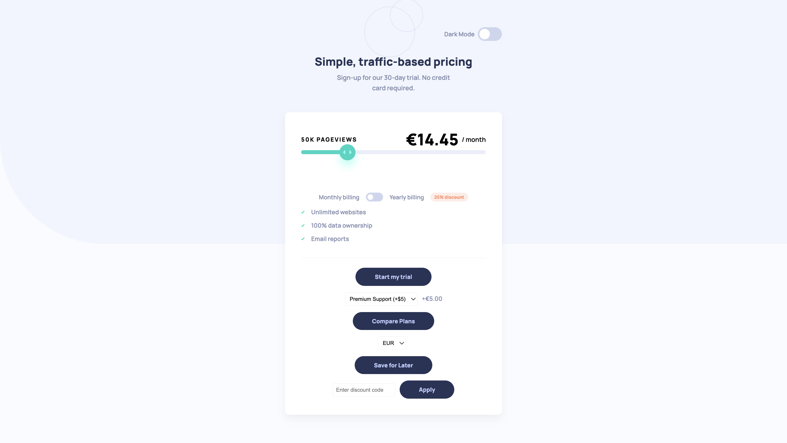
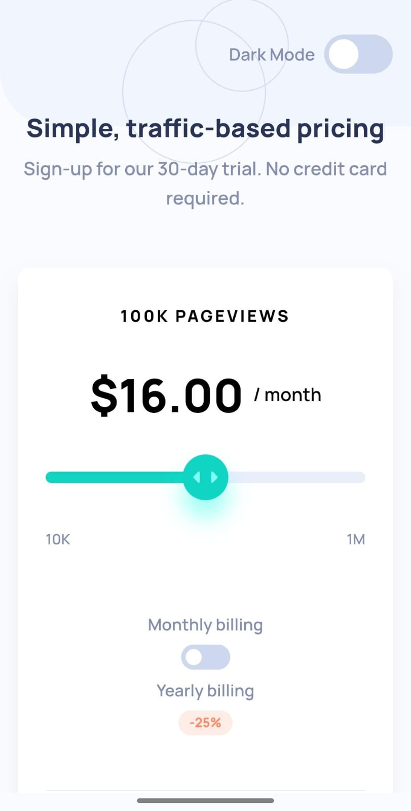

# Frontend Mentor - Interactive Pricing Component Solution

This is a solution to the Interactive Pricing Component challenge on [Frontend Mentor](https://www.frontendmentor.io/challenges/interactive-pricing-component-t0m8PIyY8). Frontend Mentor challenges help you improve your coding skills by building realistic projects.

---

## 📑 Table of contents
- [Overview](#overview)
- [Screenshot](#screenshot)
- [Links](#links)
- [My process](#my-process)
- [Features](#features)
- [Author](#author)
- [Acknowledgments](#acknowledgments)

---

## 📝 Overview

### The challenge
Users should be able to:

- View the optimal layout for the app depending on their device's screen size
- See hover states for all interactive elements on the page
- Use the slider and toggle to see prices for different page view numbers
- Switch between **light & dark mode**
- Save preferences for slider, billing type, and theme in localStorage

---

## 📸 Screenshot

### 💻 Desktop View

### 📱 Mobile View

---

## 🔗 Links

- **Solution URL:** [GITHUB](#https://github.com/Samkitjain22/interactive-pricing-component)
- **Live Site URL:** [LIVE WEBSITE](#https://samkitjain22.github.io/interactive-pricing-component)

---

## ⚒️ My process

### Built with
- Semantic **HTML5** markup  
- **CSS custom properties**  
- **Flexbox** & **CSS Grid**  
- Mobile-first workflow  
- **Vanilla JavaScript** for interactions  

---

## 📚 What I learned
While working on this project, I gained a deeper understanding of:

- Implementing dynamic pricing calculations using JavaScript based on slider input.
- Managing theme toggling (light/dark mode) with CSS variables and JavaScript event handling.
- Creating responsive layouts using CSS Grid and Flexbox with a mobile-first approach.
- Handling user interactions like drag-and-drop sliders and keyboard accessibility.

---

## 🚀 Features

- **Dynamic Pricing Slider** – Adjusts the price and page views based on slider position (10K to 1M pageviews with corresponding prices).  
- **Billing Toggle** – Switches between monthly and yearly billing, applying a 25% discount for yearly plans.  
- **Theme Toggle** – Switches between light and dark modes with CSS variables.  
- **Currency Selection** – Allows switching between USD, EUR, and INR, updating the currency symbol and price accordingly.  
- **Add-ons** – Adds optional premium support or extra storage costs to the base price.  
- **Save Preferences** – Saves user settings (slider value, billing type, add-ons, currency) in `localStorage`.  
- **Discount Code** – Applies a one-time $2 discount with the code `"SAVE25"`.  
- **Comparison Tool** – Displays a comparison of plans via an alert.  
- **Testimonial Slider** – Automatically cycles through user testimonials every 5 seconds.  
- **Responsive Design** – Adapts layout and styling for mobile and desktop screens.  
- **Consistent Button Styling** – All interactive buttons (e.g., "Start my trial", "Save for Later", "Compare Plans", "Apply") share the same design.  

---

## 👨‍💻 Author
- Website – Samkit Jain

---

## 🙏 Acknowledgments
Special thanks to the Frontend Mentor community for providing this challenge and to the xAI team for assisting with the development process.
